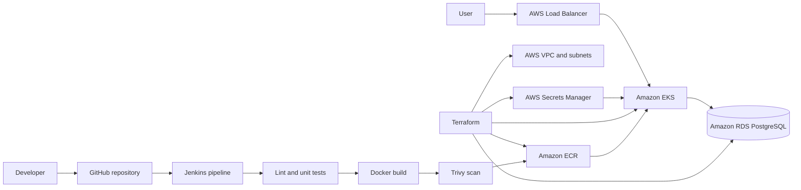

# DevOps Starter Kit

A production-oriented, beginner-accessible reference project demonstrating an end-to-end DevOps workflow with **Python, PostgreSQL, Docker, Docker Compose, Jenkins, Terraform, AWS ECR, Amazon EKS, Amazon RDS, AWS Secrets Manager, Kubernetes, and an AWS Load Balancer**.

The included Flask application is a deployment tracker. It provides a web interface and REST API, stores deployment records in PostgreSQL, and displays runtime details such as the application version, Git commit, pod name, and node name.

## What this project demonstrates

- Application containerization with a secure multi-stage Docker image
- Local multi-container development with Docker Compose
- Automated linting and tests
- Jenkins-based CI/CD
- Docker image vulnerability scanning with Trivy
- Infrastructure as Code with Terraform
- AWS networking, ECR, EKS, RDS, IAM, CloudWatch, and Secrets Manager
- Kubernetes deployments, rolling updates, probes, resource limits, and disruption protection
- Public application access through an AWS-managed load balancer
- Complete AWS deployment and cleanup scripts

## Architecture



## Repository structure

```text
.
├── app/                       Flask application, UI, and tests
├── jenkins/                   Local Jenkins image and Compose setup
├── k8s/                       Kubernetes manifests
├── scripts/                   Deployment, smoke-test, and cleanup scripts
├── terraform/                 Complete AWS infrastructure
├── .dockerignore
├── .env.example
├── .gitignore
├── Dockerfile
├── Jenkinsfile
├── LICENSE
├── Makefile
├── README.md
└── docker-compose.yml
```

## Prerequisites

For local use:

- Git
- Docker Desktop or Docker Engine with Docker Compose

For direct AWS deployment:

- AWS CLI
- Terraform
- Docker
- kubectl
- jq
- An AWS account with sufficient permissions

## 1. Clone the repository

```bash
git clone https://github.com/<your-username>/devops-starter-kit.git
cd devops-starter-kit
```

## 2. Run locally with Docker Compose

The repository contains safe development defaults, so it can run without creating a `.env` file.

```bash
make local-up
```

Open:

- Application: `http://localhost:5000`
- Health endpoint: `http://localhost:5000/health`
- Readiness endpoint: `http://localhost:5000/ready`
- API: `http://localhost:5000/api/deployments`

Run a smoke test:

```bash
make local-smoke
```

View logs:

```bash
make local-logs
```

Stop the local stack:

```bash
make local-down
```

To use custom local database values:

```bash
cp .env.example .env
```

Then update `.env`. The real `.env` file is ignored by Git.

## 3. Run tests locally without Docker

```bash
python3 -m venv .venv
source .venv/bin/activate
pip install -r app/requirements.txt flake8
make lint
make test
```

On Windows PowerShell:

```powershell
python -m venv .venv
.venv\Scripts\Activate.ps1
pip install -r app/requirements.txt flake8
make lint
make test
```

## 4. Start Jenkins locally

```bash
make jenkins-up
```

Open `http://localhost:8080`.

Retrieve the initial password:

```bash
docker exec devops-starter-kit-jenkins \
  cat /var/jenkins_home/secrets/initialAdminPassword
```

The custom Jenkins image includes:

- Docker CLI and Docker Compose
- AWS CLI
- Terraform
- kubectl
- Python
- Git
- jq
- Required Jenkins plugins

### Configure AWS credentials in Jenkins

1. Open **Manage Jenkins → Credentials → System → Global credentials**.
2. Add an **AWS Credentials** entry.
3. Set its ID to `aws-credentials`.
4. Use a temporary learning account or properly scoped IAM credentials.

### Create the pipeline

1. Select **New Item**.
2. Choose **Pipeline**.
3. Select **Pipeline script from SCM**.
4. Choose **Git** and enter this repository URL.
5. Set the branch to `*/main`.
6. Keep `Jenkinsfile` as the script path.
7. Save and select **Build with Parameters**.
8. Enable `APPLY_INFRA` for the first build.

Later builds can leave `APPLY_INFRA` disabled and deploy only a new application image.

### Jenkins pipeline stages

```text
Checkout
  → Lint and unit tests
  → Terraform validation
  → Optional Terraform apply
  → Docker build
  → Trivy image scan
  → Push to Amazon ECR
  → Deploy to Amazon EKS
  → Verify Kubernetes rollout
```

## 5. Deploy directly to AWS

Configure AWS credentials:

```bash
aws configure
```

Optionally customize Terraform values:

```bash
cp terraform/terraform.tfvars.example terraform/terraform.tfvars
```

For improved security, replace `0.0.0.0/0` in `cluster_public_access_cidrs` with your public IP in `/32` format.

Deploy the complete project:

```bash
make aws-deploy
```

The script will:

1. Provision the VPC and subnets.
2. Create IAM roles.
3. Create the EKS cluster and managed node group.
4. Create the ECR repository.
5. Create a private RDS PostgreSQL database.
6. Store the database URL in Secrets Manager.
7. Build and push the Docker image.
8. Configure kubectl.
9. Create the Kubernetes secret.
10. Deploy the application and load balancer.
11. Print the application hostname when it becomes available.

Useful commands after deployment:

```bash
kubectl -n devops-starter-kit get all
kubectl -n devops-starter-kit get service devops-starter-kit-service
kubectl -n devops-starter-kit logs deployment/devops-starter-kit-app
```

## 6. API examples

Create a deployment record:

```bash
curl -X POST http://localhost:5000/api/deployments \
  -H 'Content-Type: application/json' \
  -d '{"service_name":"starter-api","environment":"production","status":"SUCCESS"}'
```

List deployment records:

```bash
curl http://localhost:5000/api/deployments
```

Application runtime information:

```bash
curl http://localhost:5000/api/info
```

## 7. Remove AWS resources

EKS, EC2 worker nodes, RDS, and the load balancer incur AWS charges.

Delete the Kubernetes load balancer and destroy all Terraform-managed infrastructure:

```bash
make aws-destroy
```

Confirm in the AWS Console that no unexpected project resources remain.

## Security notes

- Do not commit `.env`, Terraform state files, credentials, or private keys.
- Restrict the EKS public API CIDR before using the project outside a temporary lab.
- Replace broad demonstration permissions with least-privilege IAM permissions.
- Use a remote encrypted Terraform backend with state locking for team environments.
- The local database password is intentionally a development-only default.

## Cost notes

This is not a free AWS architecture. The following services can generate charges:

- Amazon EKS control plane
- EC2 managed worker nodes
- Amazon RDS
- AWS Load Balancer
- CloudWatch logs
- Secrets Manager

The Terraform configuration avoids a NAT Gateway to reduce learning-environment cost. Always run `make aws-destroy` after a demonstration.

## Portfolio talking points

- Built a multi-stage non-root Docker image with health checks.
- Created a reproducible local environment with Docker Compose and PostgreSQL.
- Provisioned AWS VPC, EKS, ECR, RDS, IAM, CloudWatch, and Secrets Manager using Terraform.
- Automated linting, testing, vulnerability scanning, image publishing, and Kubernetes rollout with Jenkins.
- Implemented readiness and liveness probes, rolling updates, resource controls, two replicas, and a PodDisruptionBudget.
- Kept the database private and injected its connection URL into EKS through a Kubernetes Secret.

## Beginner learning path

A new learner can use the repository in this order:

1. Run the Flask application locally.
2. Start the complete local stack with Docker Compose.
3. Inspect and modify the Dockerfile.
4. Run tests and linting.
5. Start Jenkins and execute the pipeline locally.
6. Review the Terraform resources.
7. Review the Kubernetes manifests.
8. Deploy the project to AWS.
9. Make an application change and observe the automated redeployment.
10. Destroy the AWS environment.
